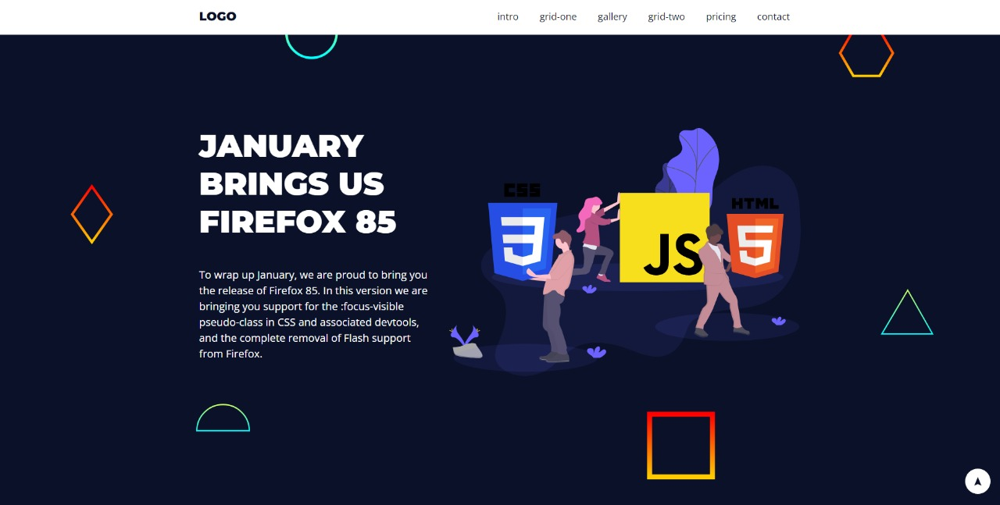

<h1 align="center">
  💻 Landing Page
</h1>

---

<h4 align="center"><a href="https://landingpagecursots.vercel.app">Clique para visitar o projeto</a></h4>

---

## 💼 Tecnologias utilizadas

**Obs**: Os comportamentos em JavaScript que o exercicio pede serão adicionados em breve...

Utilizei apenas essas tecnologias com base em práticar meus conhecimentos:

-  HTML;
-  CSS;

---

> #### Projeto feito no curso de JavaScript e TypeScript do Otávio Miranda na Udemy!
>
> - <a href="https://www.udemy.com/course/curso-de-javascript-moderno-do-basico-ao-avancado/">Clique aqui</a> para vizualizar a página do curso.
> - <a href="https://github.com/luizomf">Clique aqui</a> para acessar ao perfil do criador do projeto no GitHub.
>
---
